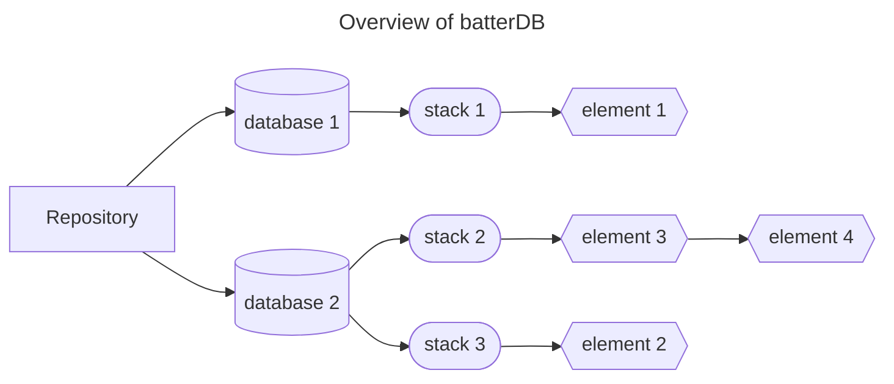

[](https://pkg.go.dev/github.com/jh125486/batterdb)
[](https://goreportcard.com/report/github.com/jh125486/batterdb)
[](https://raw.githack.com/wiki/jh125486/batterdb/coverage.html)
[](https://github.com/jh125486/batterdb/actions/workflows/golangci-lint.yml)
[](https://github.com/jh125486/batterdb/actions/workflows/github-code-scanning/codeql)
```
______       _   _           ____________
| ___ \     | | | |          |  _  \ ___ \
| |_/ / __ _| |_| |_ ___ _ __| | | | |_/ /
| ___ \/ _' | __| __/ _ \ '__| | | | ___ \
| |_/ / (_| | |_| ||  __/ |  | |/ /| |_/ /
\____/ \__,_|\__|\__\___|_|  |___/ \____/
```

## What is batterdb?

**batterdb** operates as a stack-based database. It functions by pushing **_Elements_** onto **_Stacks_**. Consequently, you can only interact with the topmost _**Element**_, while the remaining elements are stored beneath it.


## Basic Concepts

### `batterdb`

**`batterdb`** is a server program that initializes the _Repository_. It provides an HTTP interface for external users, allowing operations such as creating or deleting _Databases_, _Stacks_, and performing stack (`PUSH`, `POP`, etc.) operations on Elements.

### Repository

The **_Repository_** is the central component of **batterdb**. It houses all the _Databases_ that you create, and listens for incoming connections.

### Database

A **_Database_** is a collection of _Stacks_. You have the flexibility to create multiple _Databases_, each operating independently of the others.

### Stack

A **_Stack_** represents a linear data structure that contains _Elements_, based on the LIFO (_Last in, First out_) principle, and in which only these operations are allowed:

* **`PUSH`**: Introduces an Element into the Stack.
* **`POP`**: Removes the topmost Element of the Stack.
* **`PEEK`**: Returns the topmost Element of the Stack, but this is not modified.
* **`SIZE`**: Returns the size of the Stack.
* **`FLUSH`**: Delete all Elements of the Stack, leaving it empty.

Every operation applied to a **Stack** has a O(1) complexity, and will block further incoming or concurrent operations, which ensures consistent responses within a reasonable amount of time.

### Element

An **_Element_** refers to a data unit that can be pushed into a Stack. It is compatible with the JSON format. Examples of data types that **batterdb** can handle:

* Number: `42`, `3.14`, `.333`, `3.7E-5`.
* String: `foo`, `PilaDB`, `\thello\nworld`, ` `, 💾.
* Boolean: `true`, `false`.
* Array: `["🍎","🍊","🍋"]`, `[{"foo":false}, true, 3, "bar"]`.
* Object: `{}`, `{"key": "Value"}`, `{"bob":{"age":32,"married":false,"comments":{}}}`.
* `null`.


## Installation

### Download

Windows, macOS, and Linux binaries are available.
You can download the latest release from the [releases page](/releases/latest).

### Installing using Go

Alternativelm, you can install the project from source by:

```shell
go install github.com/jh125486/batterdb@latest
```

## Usage

### Command line

```shell
Usage: batterdb <command> [flags]

A simple stacked-based database 🔋.

Flags:
  -h, --help                         Show context-sensitive help.
  -p, --port=1205                    Port to listen on.
  -s, --store                        Persist the database to disk.
      --repo-file=".batterdb.gob"    The file to persist the database to.
  -v, --version                      Show version.

Commands:
  server [flags]
    Start the server.

  open-api [flags]
    Output the OpenAPI specification version.

Run "batterdb <command> --help" for more information on a command.
```

*Note*: The `--store` flag will store the repository by default as `.batterdb.gob` in the current directory, but you can change it with the `--repo-file` flag.

### Online documentation

`batterdb` uses OpenAPI to document its API, and when the server is running it is available at [http://localhost:1205/openapi.yaml](http://localhost:1205/openapi.yaml).

To dump the spec for use in generators, you can use the `open-api` subcommand flag with the version (3.1 or 3.0.3) you want to use. The specs are also available committed to the repo: 
- [3.1](https://raw.githubusercontent.com/jh125486/batterdb/main/openapi.yaml)
- [3.0.3](https://raw.githubusercontent.com/jh125486/batterdb/main/openapi.downgraded.yaml)

Generating a client is beyond the scope of this README, but many are available at [OpenAPI Generator](https://openapi-generator.tech/). 

## Inspiration/credits

This project is inspired by [PilaDB](https://github.com/fern4lvarez/piladb), and the name is a pun on "_stack_" ➟ "_pila_" ➟ "_battery_" ➟ "_battery DB_" ➟ "**_batterdb_**".
